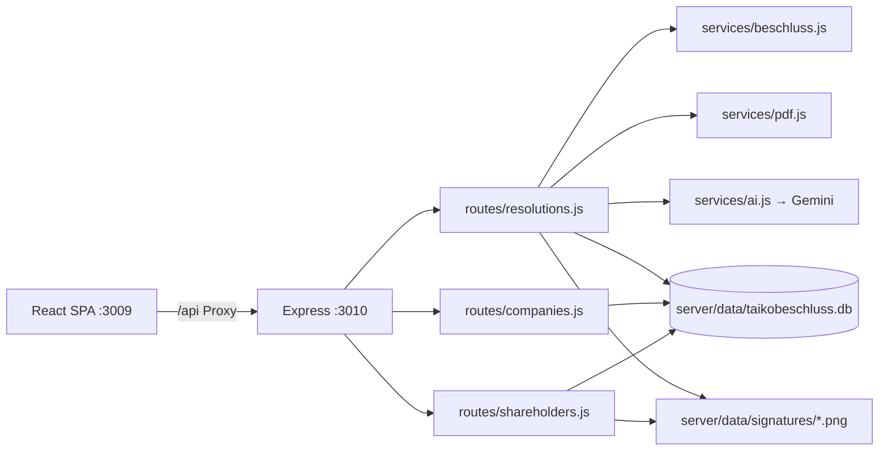
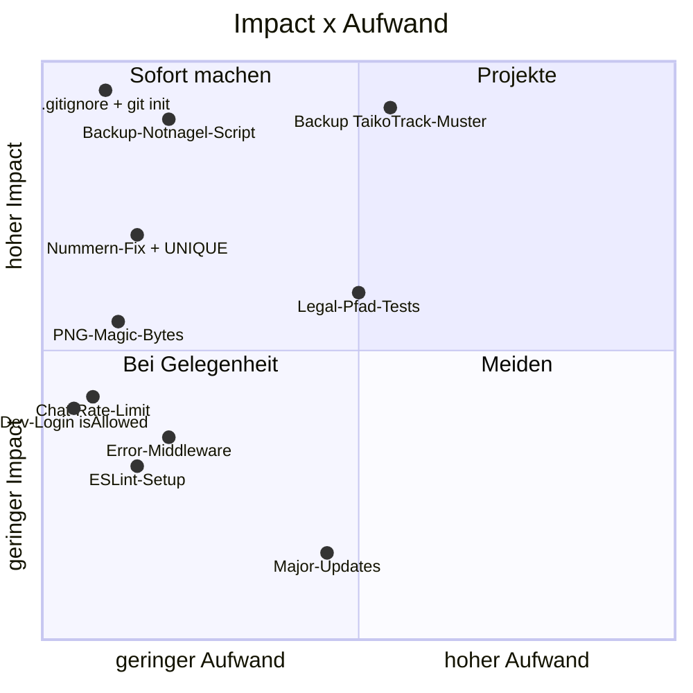

# Code Health Report — TaikoBeschluss — 2026-07-22

## Executive Summary

**Score: 24/100 (F)** — der Code selbst ist sauber (klein, konsistent, parametrisiertes SQL,
Build + Tests gruen), aber die **Daten-Situation ist ein Totalausfall-Risiko**: rechtlich
relevante, unterschriebene Beschluesse liegen als Single Copy auf einer SSD — kein Backup,
kein Git, kein .gitignore. Ein Hardware-Defekt oder ein falscher Befehl loescht alles
unwiederbringlich. **Top-Quick-Win:** `git init` + `.gitignore` + erstes tägliches Backup
ausserhalb des Projekt-Trees (< 1 h Gesamtaufwand fuer alle drei).

## Projekt-Steckbrief

Internes MVP-Tool (React 19/Vite + Express 5/SQLite), 24 Dateien, **3.190 LOC**.
Kein Git-Repo, keine CI, lokal lauffaehig, noch nicht deployed. Architektur sauber
geschichtet: Routes → Services (beschluss/pdf/ai) → SQLite; eine Quelle der Wahrheit
fuer den Beschluss-Rahmen (`buildFrame`).

## Scorecard

| Kategorie | Score | Severity | Confidence | Aufwand Fix |
|---|---|---|---|---|
| Datenverlust-Schutz / Backup | 0/10 | 🔴 | high | 🔧 Mittel |
| Versionskontrolle (Git) | 0/10 | 🔴 | high | ⚡ Quick Win |
| Secret-Hygiene (.gitignore/.env) | 2/10 | 🔴 | high | ⚡ Quick Win |
| Korrektheit (Nummern-Vergabe) | 6/10 | 🟡 | high | ⚡ Quick Win |
| Input-Validierung (PNG-Uploads) | 5/10 | 🟡 | high | ⚡ Quick Win |
| Security (Session/CSP/RateLimit) | 7/10 | 🟡 | high | ⚡ Quick Win |
| Test-Abdeckung | 4/10 | 🟡 | high | 🔧 Mittel |
| Error-Handling | 6/10 | 🟡 | medium | ⚡ Quick Win |
| Dependencies | 8/10 | 🟡 | high | ⚡ Quick Win |
| Code-Qualitaet/Struktur | 9/10 | 🟢 | high | — |
| Code-Hygiene (TODO/Lint/ESM) | 8/10 | 🟢 | high | — |

## Metriken-Dashboard

| Metrik | Wert | Bewertung |
|---|---|---|
| LOC gesamt (JS/JSX) | 3.190 in 24 Dateien | 🟢 klein |
| Groesste Datei | Editor.jsx 425 LOC | 🟢 kein Monolith (Verdacht aus Handoff **entkraeftet**) |
| Zweitgroesste | resolutions.js 353 LOC | 🟢 ok, gut gegliedert |
| Build | gruen (798 ms, 248 kB JS) | 🟢 |
| Tests | 2/2 gruen, nur Backend-Smoke | 🟡 |
| TODO/FIXME | 0 | 🟢 |
| console.log | 1 (Server-Start) | 🟢 |
| ESM-Konsistenz | 0 require() | 🟢 |
| Lint/Format-Config | keine | 🟡 |
| npm audit Root | 2 high (nur devDep `concurrently`) | 🟡 |
| npm audit Server | 0 | 🟢 |
| Outdated (Major) | vite 8, lucide 1.x, better-sqlite3 13 u.a. | 🟡 unkritisch |
| DB | 80 kB .db + **4 MB .db-wal** + 10 Signatur-PNGs (4,7 MB) | 🟡 WAL beachten |

## Top-Befunde

### 1. 🔴 Keine Backup-Strategie — Datenverlust = Totalverlust (Confidence: high, 🔧 Mittel)

**Data-Safety-Checkliste (`~/.claude/data-safety-checklist.md`) Phasen A–E:**

- **A Discovery:** Persistenter State = `server/data/taikobeschluss.db` (+ `-wal`/`-shm`),
  `server/data/signatures/*.png` (10 Dateien, inkl. geleisteter Unterschriften auf
  freigegebenen Beschluessen), `server/.env` (Secrets). **Alles Source of Truth, keine
  Kopie** — es gibt keine externe Quelle zum Re-Sync. Session-Store liegt in derselben DB.
- **B Backup-Audit:** ❌ **Es existiert kein einziges Backup.** Kein Scheduled-Backup, kein
  Offsite, kein Integrity-Check, kein Restore-Drill. 3-2-1-Regel: aktuell **1-1-0**.
  Zusatzrisiko: Die WAL-Datei (4 MB) ist groesser als die DB (80 kB) — ein naives Kopieren
  nur der `.db`-Datei wuerde fast alle Daten verlieren. Backups muessen `VACUUM INTO` oder
  die better-sqlite3 `db.backup()`-API nutzen.
- **C Angriffsflaeche:** Ein `rm -rf server/data/` (oder Projektordner-Loeschung,
  SSD-Ausfall, macOS-Reinstall) vernichtet DB **und** Signaturen in einem Schritt — exakt
  das TaikoTrack-Muster (Live-Daten und einziger Speicherort im selben Parent). Da kein
  Git existiert, waere auch der **Code** weg. `fs.rmSync` an 4 Stellen
  ([resolutions.js:163](server/routes/resolutions.js:163), [resolutions.js:194](server/routes/resolutions.js:194),
  [shareholders.js:57](server/routes/shareholders.js:57), [shareholders.js:81](server/routes/shareholders.js:81)) —
  alle gezielt auf Einzeldateien, `force: true`, ok.
- **D Guardrails:** keine (kein Verify-Gate, kein Safety-Marker, kein README in `server/data/`).
- **E Action-Items:** siehe Empfohlene Reihenfolge unten (Backup raus aus dem Projekt-Tree,
  Scheduled via LaunchAgent, Offsite-Mirror, Restore-Drill). Referenz-Implementierung:
  `~/Projects/TaikoTrack/server/lib/backup.js` + `scripts/install-backup-schedule.sh`.

**Auswirkung:** RPO = ∞. Bei Verlust sind unterschriebene Gesellschafterbeschluesse
(rechtlich relevante Dokumente) unwiederbringlich weg.

**Fix-Strategien:**
1. **TaikoTrack-Muster uebernehmen** (empfohlen): `server/lib/backup.js` adaptieren —
   `db.backup()` nach `~/Library/Application Support/TaikoBeschluss/backups/`, Signaturen
   per rsync mit, tiered Retention, LaunchAgent taeglich + RunAtLoad. Aufwand: ~0,5 Tag.
   Pro: erprobt, erfuellt Checkliste. Contra: etwas Code.
2. **Minimal-Variante:** Ein Backup-Script (`VACUUM INTO` + `cp -R signatures/`) manuell/
   per LaunchAgent. Aufwand: 1–2 h. Pro: schnell. Contra: kein Offsite, keine Retention —
   nur als Sofortmassnahme, nicht als Endzustand.

**Empfehlung:** Sofort Variante 2 als Notnagel, dann Variante 1. Fuer Legal-Dokumente sind
die Standard-RPO-Ziele der Checkliste eher zu weich — Offsite ist Pflicht.

### 2. 🔴 Kein Git-Repo + kein .gitignore (Confidence: high, ⚡ Quick Win)

Der gesamte Code existiert nur in diesem Ordner — keine Historie, kein Remote, kein Undo.
Zusaetzlich fehlt `.gitignore`: bei einem spaeteren `git init && git add .` landen
`server/.env` (Gemini-Key, Google-OAuth-Secret), `server/data/` (DB + Unterschriften!)
und `node_modules` im Repo — bei Push waeren die Secrets kompromittiert.

**Fix:** `.gitignore` (node_modules, dist, server/.env, server/data/, coverage) **zuerst**
anlegen, dann `git init` + Initial-Commit. Aufwand: 10 min. Kein sinnvolles Contra.

### 3. 🟡 Beschluss-Nummern-Vergabe kann Duplikate erzeugen (Confidence: high, ⚡ Quick Win)

[resolutions.js:96-99](server/routes/resolutions.js:96): `COUNT(*) + 1` je Firma+Jahr.
Wird ein Beschluss **endgueltig geloescht**, sinkt der Count → die naechste Nummer
kollidiert mit einer bestehenden. Beispiel: 2026-01…03 existieren, 2026-02 wird permanent
geloescht → naechster neuer Beschluss bekommt wieder „2026-03". Fuer fortlaufend
nummerierte Rechtsdokumente ein echtes Problem. Kein UNIQUE-Constraint faengt das ab.

**Fix-Strategien:**
1. `MAX(CAST(substr(number, 6) AS INTEGER)) + 1` statt COUNT (empfohlen, 5 Zeilen) +
   `UNIQUE(company_id, number)`-Index als Sicherheitsnetz.
2. Nur UNIQUE-Constraint (Fehler statt Duplikat) — schlechtere UX.

### 4. 🟡 Raw-PNG-Uploads ohne Format-Validierung (Confidence: high, ⚡ Quick Win)

[resolutions.js:199-200](server/routes/resolutions.js:199) und
[shareholders.js:66-67](server/routes/shareholders.js:66): Der Request-Body wird verbatim
als `.png` gespeichert — nur der Content-Type-Header (frei waehlbar) und das 5-MB-Limit
begrenzen. Eine Nicht-PNG-Datei laesst spaeter `doc.embedPng()` in
[pdf.js:101](server/services/pdf.js:101) werfen → **PDF-Export des Beschlusses dauerhaft
kaputt (500)**, bis die Signatur ersetzt wird.

**Fix:** Magic-Bytes pruefen (PNG-Header `89 50 4E 47 0D 0A 1A 0A`, 8 Bytes, eine
Hilfsfunktion, beide Routen). Alternativ embedPng bei Upload probeweise ausfuehren —
teurer, unnoetig.

### 5. 🟡 Security-Kleinigkeiten (Confidence: high, ⚡ Quick Win)

- **Dev-Login umgeht `isAllowed`** ([index.js:97-106](server/index.js:97)): jede beliebige
  E-Mail wird als User angelegt und eingeloggt. Nur aktiv bei `DEV_LOGIN=1` + non-prod +
  Bind auf 127.0.0.1 — Restrisiko: Prod-Start mit vergessenem `DEV_LOGIN=1` scheitert nur
  an `NODE_ENV`. Ein `isAllowed`-Check auch hier kostet 1 Zeile.
- **Chat-Endpoint ohne Rate-Limit** ([resolutions.js:273](server/routes/resolutions.js:273)):
  `authLimiter` gilt nur fuer Auth-Routen; jeder eingeloggte Nutzer kann unbegrenzt
  LLM-Calls (Kosten) ausloesen. Ein `rateLimit` auf `/api/resolutions/:id/chat` genuegt.
- **Papierkorb-Beschluesse** sind weiterhin sign-/release-/PDF-bar (kein `deleted_at`-Check
  in diesen Routen) — inkonsistent, aber kein Datenrisiko.
- Positiv: SESSION_SECRET-Pflicht in Prod erzwungen, helmet-CSP konfiguriert,
  Cookies httpOnly+sameSite=lax+secure(prod), SQL 100 % parametrisiert, FS-Pfade nie im
  JSON, Path-Traversal bei Signatur-Dateien faktisch durch den vorherigen DB-Lookup blockiert.

### 6. 🟡 Test-Abdeckung minimal (Confidence: high, 🔧 Mittel)

2 Backend-Smoke-Tests, keine Frontend-Tests, keine Coverage-Messung. Ungetestet u.a.:
Nummern-Vergabe (siehe Befund 3!), Papierkorb-Lifecycle, Chat-Endpoint (LLM mockbar),
`buildFrame` je Rechtsform, `usePagination`. **Empfehlung:** gezielt Tests fuer die
Geld/Legal-Pfade (Nummern, Release, Permanent-Delete inkl. Datei-Cleanup, buildFrame),
kein Coverage-Theater.

### 7. 🟡 Restliches (Confidence: high, ⚡ je < 1 h)

- **Kein zentrales Error-Handling:** Express-5-Default faengt zwar async-Fehler, aber ohne
  Error-Middleware gibt es keine einheitlichen JSON-Fehler + Logging. ~15 Zeilen.
- **`concurrently` 2 high Vulns** (nur dev): `npm audit fix` bzw. Major-Update.
- **Keine ESLint-Config:** minimal `eslint.config.js` mit `eslint:recommended` +
  `react-hooks` genuegt — haette die `0 &&`-Falle (2× aufgetreten) maschinell gefangen.
- **Majors offen** (vite 8, lucide 1.x, better-sqlite3 13, jest-dom 7, plugin-react 6):
  kein Handlungsdruck, bei Gelegenheit.

## Prioritaets-Matrix

## Empfohlene Reihenfolge

1. **`.gitignore` anlegen + `git init` + Initial-Commit** (10 min) — schuetzt Code sofort,
   verhindert kuenftigen Secret-Leak.
2. **Backup-Notnagel** (1–2 h): Script mit `VACUUM INTO` + Signaturen-Copy nach
   `~/Library/Application Support/TaikoBeschluss/backups/`, sofort einmal ausfuehren.
3. **Backup richtig** (0,5 Tag): TaikoTrack-Muster — tiered Retention, LaunchAgent
   (RunAtLoad + StartInterval), Offsite-Mirror (iCloud/rclone), Restore-Drill,
   README/Safety-Marker in `server/data/`.
4. **Nummern-Vergabe fixen** (MAX statt COUNT + UNIQUE-Index) + Test dazu (1 h).
5. **PNG-Magic-Bytes-Check** in beide Upload-Routen (30 min).
6. **Security-Kleinigkeiten**: Dev-Login-isAllowed, Chat-Rate-Limit, deleted_at-Guards (1 h).
7. **Error-Middleware + ESLint** (1–2 h).
8. **Tests fuer Legal-Pfade** (0,5 Tag), `npm audit fix` fuer concurrently nebenbei.

Punkte 1–3 sind **vor** dem naechsten produktiven Einsatz faellig; 4–5 vor dem Deployment;
6–8 normale Wartung.
