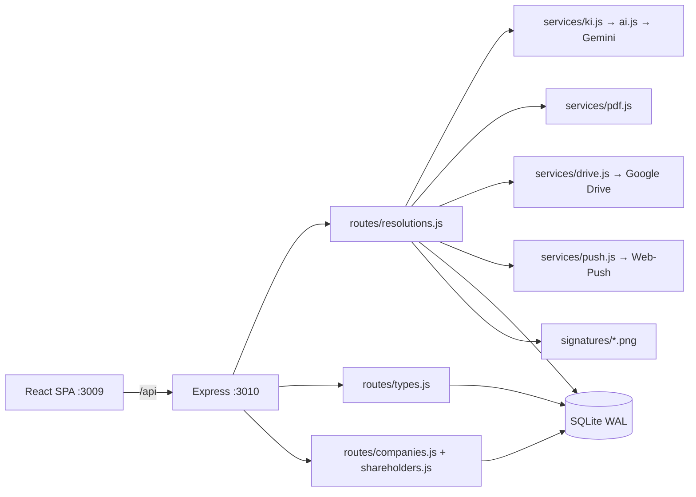
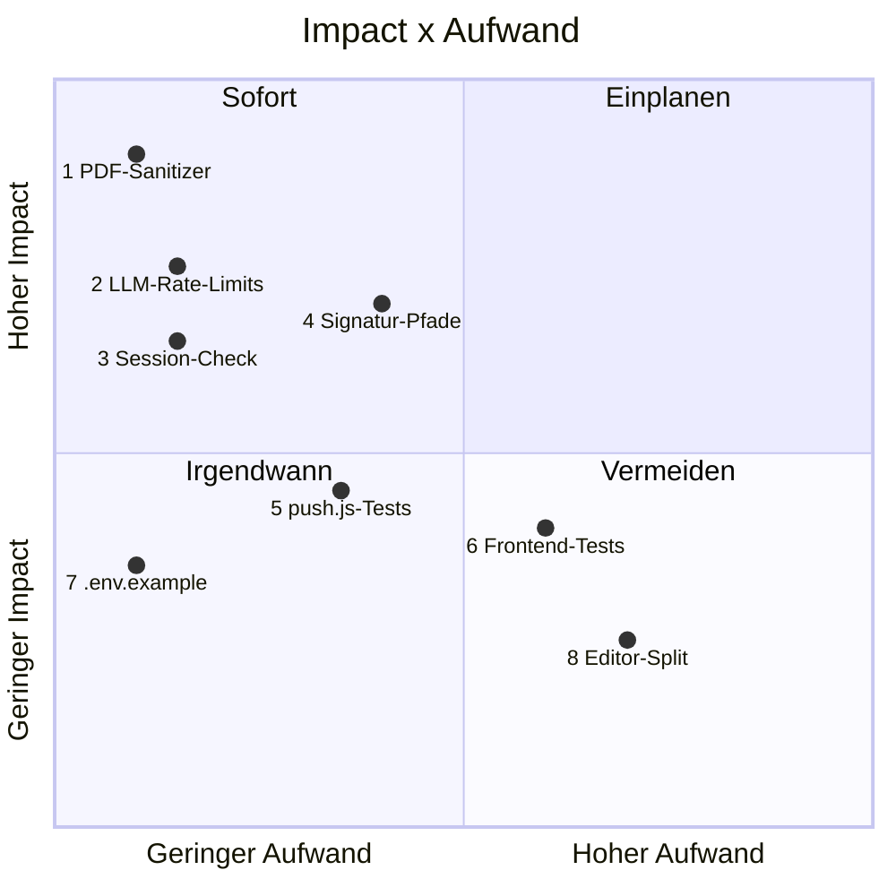

# Code Health Report — TaikoBeschluss — 2026-07-24 (Session 4)

> Ersetzt den Report vom 2026-07-22 (Session 2, Score 24/100). Vollstaendiges
> Audit: Code-Health + Security, jede Quelldatei gelesen (Server, Client, Tests,
> Infra), Messungen mit Tools (vitest/coverage, ESLint, npm audit, gitleaks,
> knip, jscpd, Audit-Skill-Helpers).

## Executive Summary

**Score: 68/100 (C)** — dramatische Verbesserung gegenueber 24/100 (F): **alle
5 kritischen Befunde aus Session 2 sind behoben** (Backup-Kette Mac+NAS+Offsite,
Git+CI+Coverage-Ratchet, Secret-Hygiene sauber, Nummern-UNIQUE-Index,
PNG-Magic-Bytes). Keine 🔴-Blocker mehr. Der Score wird von 8 🟡-Risiken
gedrueckt, davon sind 4 in Summe < 1 Tag behebbar.
**Top-Risiko:** `buildResolutionPdf` sanitized nicht — ein einziges
Nicht-Latin-1-Zeichen im Beschlusstext (Emoji, Sonderzeichen aus Copy-Paste)
wirft den PDF-Export und den automatischen Drive-Upload mit 500 ab.
**Top-Quick-Win:** WinAnsi-Sanitizer (existiert schon fuers Dossier) auch im
Beschluss-PDF anwenden — eine Zeile.

## Delta zu Session 2 (Baseline 24/100)

| Befund Session 2 | Status heute |
|---|---|
| 🔴 Keine Backup-Strategie (RPO = ∞) | ✅ behoben: Mac-LaunchAgent (VACUUM INTO + Integrity + Drive-Mirror), NAS-Cron (backup.sh mit Integrity, JSON-Export, Verschluesselungs-Guard, Healthcheck-Ping), Restore-Drill-Test |
| 🔴 Kein Git-Repo / .gitignore | ✅ behoben: GitHub + CI (Tests, Coverage-Ratchet 90/68, Docker→GHCR), .gitignore/.dockerignore decken .env, data/, SA-Key |
| 🔴 Secret-Hygiene | ✅ behoben: gitleaks — 0 Leaks in 59 Commits; lokale Secrets (server/.env, drive-sa.json) korrekt ignoriert |
| 🟡 Nummern-Duplikate | ✅ behoben: UNIQUE-Index (company_id, number) |
| 🟡 PNG-Uploads ohne Validierung | ✅ behoben: Magic-Bytes-Check (services/png.js) |
| 🟡 Tests minimal (2 Smoke) | ✅ 84 Tests, Lines 94 % / Branches 74,8 % — aber s. Befund 6 (Frontend-Blindspot) |
| 🟡 Kein Lint | ✅ ESLint 9 flat config, 0 Fehler |
| 🟡 npm audit 2 high (dev) | ✅ 0 Vulnerabilities (Root + Server, prod + dev) |

## Projekt-Steckbrief

Produktives internes Tool (laeuft live auf Synology NAS, echte Beschluesse,
Anwalts-Feedback-Loop). React 19/Vite 7 + Express 5/SQLite, 52 Dateien,
**7.309 LOC** (Session 2: 3.190). Kern: 3-stufige KI-Pipeline
(Composer→Pruefagent→Reconciliation) mit Norm-Bibliothek als Anker
(services/ki.js), eine Quelle der Wahrheit fuer den Beschluss-Rahmen
(buildFrame), PDF via pdf-lib, Drive-Ablage per Service Account, Web-Push.

## Scorecard

| Kategorie | Score | Severity | Confidence | Aufwand Fix |
|---|---|---|---|---|
| Datenverlust-Schutz / Backup | 9/10 | 🟢 | high | — |
| Secret-Hygiene | 10/10 | 🟢 | high | — |
| Build / CI / Deploy-Kette | 9/10 | 🟢 | high | — |
| Dependencies (Vulns, Aktualitaet) | 9/10 | 🟢 | high | — |
| Code-Qualitaet (Duplikation, Hygiene, Konsistenz) | 9/10 | 🟢 | high | — |
| PDF-Robustheit (WinAnsi) | 5/10 | 🟡 | high | ⚡ Quick Win |
| Kosten-Schutz (LLM-Rate-Limits) | 5/10 | 🟡 | high | ⚡ Quick Win |
| AuthZ / Session-Lifecycle | 6/10 | 🟡 | high | ⚡ Quick Win |
| Daten-Portabilitaet (Signatur-Pfade) | 6/10 | 🟡 | high | 🔧 Mittel |
| Test-Abdeckung Server | 8/10 | 🟢 | high | — |
| Test-Abdeckung Frontend + push.js | 4/10 | 🟡 | high | 🔧 Mittel |
| Doku (.env.example) | 6/10 | 🟡 | medium | ⚡ Quick Win |
| Datei-Groesse/Komplexitaet (Editor.jsx) | 7/10 | 🟡 | medium | 🏗️ nur bei Bedarf |

## Metriken-Dashboard

| Metrik | Wert | Bewertung |
|---|---|---|
| LOC (JS/JSX, ohne Tests) | 5.635 in 33 Dateien (Median 116) | 🟢 |
| Groesste Dateien | Editor.jsx 724 · resolutions.js 481 · ki.js 434 | 🟡 > 2,5× Median, aber gegliedert |
| Build | gruen (822 ms, 279 kB JS / 84 kB gzip) | 🟢 |
| Tests | 84/84 gruen, 3 s | 🟢 |
| Coverage | Lines 94,03 % / Branches 74,77 % (Ratchet 90/68 ✅) | 🟢 mit Blindspot (Befund 6) |
| ESLint | 0 Fehler | 🟢 |
| Duplikation (jscpd) | 0,96 % (7 Klone, groesster 13 Zeilen) | 🟢 |
| TODO/FIXME · require() · skipped Tests | 0 · 0 · 0 | 🟢 |
| npm audit (Root + Server) | 0 Vulnerabilities | 🟢 |
| Outdated (Major) | eslint 10, vite 8, better-sqlite3 13, lucide 1.x u.a. | 🟢 unkritisch, kein Handlungsdruck |
| gitleaks (59 Commits) | 0 Leaks; Worktree-Funde = lokale .env/SA-Key (korrekt ignoriert) | 🟢 |
| Churn-Hotspots (90 d) | resolutions.js (18), Editor.jsx (15), Companies.jsx (10) | ℹ️ decken sich mit Groesse |

## Top-Befunde

### 1. 🟡 Beschluss-PDF crasht bei Nicht-WinAnsi-Zeichen (Confidence: high, ⚡ Quick Win)

`buildDossierPdf` sanitized jeden Text auf WinAnsi ([pdf.js:133](server/services/pdf.js:133)),
`buildResolutionPdf` **nicht**. Standard-Helvetica kann nur Latin-1: ein Emoji, ein
typografisches Sonderzeichen oder ein unsichtbares Unicode-Zeichen aus Copy-Paste im
Beschlusstext (direkt editierbar via PATCH), im Firmennamen oder im signer_name wirft
`drawText` — der PDF-Download liefert 500 und, gravierender, der **automatische
Drive-Upload nach der letzten Unterschrift schlaegt still fehl** (nur Log-Zeile).
**Fix A (empfohlen):** `sanitize()` in `wrap()` bzw. an den `drawText`-Stellen von
`buildResolutionPdf` anwenden — gleiche Funktion, ~3 Zeilen, Test mit Emoji-Content.
**Fix B:** Unicode-Font einbetten (fontkit + TTF) — loest es grundsaetzlich, aber
groesserer Eingriff und neue Assets. Fuer den Use-Case reicht A.

### 2. 🟡 LLM-Endpoints ohne Rate-Limit = offener Kostendeckel (Confidence: high, ⚡ Quick Win)

`chatLimiter` (60/15 min) schuetzt nur POST `/:id/chat`. **Ungeschuetzt:**
GET `/:id/dossier` ([resolutions.js:331](server/routes/resolutions.js:331), 1 LLM-Call
pro Klick), POST `/resolution-types/retitle` und `/backfill`
([types.js:48](server/routes/types.js:48), **N LLM-Calls pro Klick**, N = Bestand).
Zusaetzlich kein Concurrency-Guard: Doppelklick auf „Bestand klassifizieren" startet
zwei parallele Loops (doppelte Kosten, harmlos im Ergebnis).
**Fix A (empfohlen):** denselben `rateLimit` auf die drei Routen legen (z. B. 10/15 min
fuer backfill/retitle, 20/15 min fuer dossier) + ein simples in-memory
`running`-Flag fuer backfill/retitle. ~10 Zeilen.
**Fix B:** globaler Limiter auf alle /api-Routen — einfacher, aber trifft auch das
Polling (`/chat/status` alle 1,5 s) und muesste hoch konfiguriert werden. A ist gezielter.

### 3. 🟡 Entfernter Gesellschafter behaelt Zugang bis zu 30 Tage (Confidence: high, ⚡ Quick Win)

`isAllowed` wird nur beim **Login** geprueft ([auth.js:10](server/auth.js:10));
`requireAuth` prueft nur, ob der User in `users` existiert — und Users werden nie
geloescht. Session-Cookie lebt 30 Tage. Wer als Gesellschafter (signer_email) entfernt
wird, behaelt also bis zu 30 Tage **Vollzugriff** (alle Firmen, Beschluesse loeschen,
fuer andere unterschreiben). Bei 2 vertrauten Nutzern heute akzeptabel, aber der Fix
ist billig und das Tool verwaltet rechtlich bindende Dokumente.
**Fix A (empfohlen):** in `requireAuth` zusaetzlich `isAllowed(user.email)` pruefen
(1 SQLite-Query pro Request — bei dieser Last irrelevant). 2 Zeilen + Test.
**Fix B:** Session-Invalidierung beim Entfernen eines Gesellschafters (Sessions-Tabelle
nach userId durchsuchen) — praeziser, aber mehr Code fuer denselben Effekt.

### 4. 🟡 Absolute Signatur-Pfade in der DB brechen bei Restore/Umzug (Confidence: high, 🔧 Mittel)

`resolution_signatures.signature_path` und `shareholders.default_signature_path`
speichern **absolute** Pfade ([resolutions.js:273](server/routes/resolutions.js:273)).
Prod schreibt `/app/data/...`, Dev `~/Projects/.../server/data/...`. Ein Restore eines
Prod-Backups auf dem Mac (oder kuenftiger Pfad-Umzug) laesst `readSignatures` die
Dateien nicht finden — **PDFs erscheinen still ohne Unterschriften** (catch schluckt).
Genau das Szenario, fuer das die Backups da sind.
**Fix A (empfohlen):** nur den Dateinamen speichern, beim Lesen mit `SIGNATURES_DIR`
joinen; Einmal-Migration in db.js (`UPDATE ... SET path = basename(path)` via JS). ~20 Zeilen.
**Fix B:** Beim Restore Pfade umschreiben (Doku im Backup-README) — fragil, verlagert
das Problem auf den Ernstfall.

### 5. 🟡 push.js zu 35 % ungetestet (Confidence: high, 🔧 Mittel)

`sendToUser`/`notifyResolution` ([push.js:14](server/services/push.js:14)) sind
fire-and-forget und fast ohne Test (35 % Lines, 27 % Branches) — gerade die
Cleanup-Logik (404/410 → Subscription loeschen) und der `exceptUserId`-Filter waeren
regressionsanfaellig. Web-push laesst sich wie ai.js mocken (Muster in chat.test.js).
**Fix:** ein Testfile mit 3 Faellen (Zustellung an Beteiligte ausser Ausloeser,
410-Cleanup, unkonfiguriert = no-op). ~1 h.

### 6. 🟡 Coverage-Blindspot: Frontend-Seiten zaehlen nicht mit (Confidence: high, 🔧 Mittel)

Die 94 % gelten nur fuer Module, die Tests importieren. **Editor.jsx (724 LoC),
Resolutions.jsx, Settings.jsx, alle Modals — 0 Tests und unsichtbar im
Coverage-Nenner.** Der Ratchet schuetzt also den Server, nicht den Client. Bewusster
Trade-off (User testet auf Prod), aber der Report soll ehrlich sein: die kritischen
UI-Flows (compose-Polling/Resume, Signatur-Flow, hints-Anzeige) haben kein Netz.
**Fix (wenn gewuenscht, nicht dringend):** 2–3 jsdom-Tests fuer die reine Logik
(z. B. compose-Status-Polling mit gemocktem api) — nicht die volle UI.
Alternativ: bewusst so lassen und hier dokumentieren. Kein Ratchet-Umbau noetig.

### 7. 🟡 19 genutzte Env-Vars fehlen im .env.example (Confidence: medium, ⚡ Quick Win)

Helper meldet u. a. `SESSION_SECRET`, `APP_URL`, `VAPID_*`, `BACKUP_*`, `DATA_DIR`,
`GOOGLE_SA_KEY`, `DRIVE_ROOT_FOLDER_ID` als undokumentiert (server/.env* ist fuer
Tools lesegesperrt, daher medium confidence — moeglicherweise teilweise vorhanden).
Neu-Setup/Restore haengt sonst an Tribal Knowledge bzw. PROJECT_HANDOFF.
**Fix:** `server/.env.example` mit allen Keys + Einzeiler-Kommentar ergaenzen. ~15 min.

### 8. 🟡 Editor.jsx 724 LoC / Nesting 5 (Confidence: medium, 🏗️ nur bei Bedarf)

Doppelt so gross wie die Kritisch-Schwelle (2,5× Median = 290) und Churn-Hotspot Nr. 2.
Intern sauber gegliedert (ComposeOverlay, HintsBubble als eigene Funktionen). **Kein
Handlungsbedarf jetzt** — aber beim naechsten groesseren Editor-Feature Overlay/Bubble
in eigene Dateien ziehen, statt weiter anzubauen. Kein Vorab-Refactoring.

### Kosmetik (gesammelt, je < 30 min, kein Einzelkapitel)

- **Chat-Fehlerpfad:** schlaegt der LLM-Call fehl, bleibt die User-Message in
  `chat_messages` haengen — Retry erzeugt Duplikat im Verlauf (und im Dossier).
  Fix: User-Insert erst nach erfolgreichem KI-Turn oder bei Fehler wieder loeschen.
- **Nummern-Race:** parallele POSTs koennen via MAX+1 kollidieren → UNIQUE-Index
  faengt es, aber als 500 statt sauberem Retry. Akzeptabel bei 2 Nutzern.
- **Ungenutzte Exports:** `CHAT_SCHEMA`, `badGermanSpelling` (ki.js) werden nirgends
  importiert — `export` entfernen.
- **Resolutions.jsx:** `user`-Prop wird uebergeben, aber nicht genutzt.
- **DELETE /shareholders/:id/signature:** fehlende 404-Pruefung → 200 mit leerem Body
  bei unbekannter ID.
- **NAS-JSON-Export** (deploy/backup.sh): `chat_messages` und `resolution_types`
  fehlen in der Format-Resilienz-Schicht (DB-Snapshot enthaelt alles — nur der
  JSON-Fallback ist unvollstaendig).
- **Dockerfile:** Container laeuft als root; `USER node` + passende Volume-Rechte
  waeren sauberer (Zugriff nur via localhost/Tunnel — niedrige Prio).
- **Editor `downloadDossier`/`saveSignature`:** rohe `fetch` ohne das
  401-Handling aus api.js (Session abgelaufen = kryptischer Fehler statt Login).

### Bewusste, dokumentierte Design-Entscheidungen (keine Befunde)

- Jeder eingeloggte Nutzer darf fuer jeden Gesellschafter unterschreiben
  (`signed_by` protokolliert) und sieht/bearbeitet alle Firmen — flaches
  Berechtigungsmodell fuer 2 vertraute Nutzer.
- `composeStatus` in-memory, Single-Prozess-Annahme (kommentiert).
- Unterschriften bleiben bei Nachbearbeitung erhalten (User-Entscheidung).
- Pruef-/Reconcile-Fehler degradieren still zum Composer-Entwurf.

## Prioritaets-Matrix

## Empfohlene Reihenfolge

1. **PDF-WinAnsi-Sanitizer** in buildResolutionPdf (⚡, Befund 1) — schuetzt den
   Kern-Flow (PDF + Drive-Ablage).
2. **Rate-Limits + running-Guard** fuer dossier/backfill/retitle (⚡, Befund 2).
3. **isAllowed in requireAuth** (⚡, Befund 3).
4. **.env.example vervollstaendigen** (⚡, Befund 7).
5. **Signatur-Pfade relativ speichern** + Migration (🔧, Befund 4).
6. **push.js-Tests** (🔧, Befund 5).
7. Kosmetik-Sammelposten in einem Aufwasch, wenn ohnehin in den Dateien gearbeitet wird.
8. Befunde 6/8 bewusst offen lassen, bis ein Anlass besteht.
