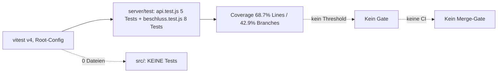

# Testing-Strategie Audit — TaikoBeschluss — 2026-07-22

> **Nachtrag 2026-07-23 — Maßnahmen umgesetzt, Re-Score: 8,5/10.**
> Alle 6 empfohlenen Schritte erledigt: GitHub-Actions-CI (lint + coverage-gated
> Tests + Build), Chat-Endpoint-Tests mit LLM-Mock (7), ai.js-Tests via fetch-Stub (6),
> auth.js-Tests (6), Backup-Restore-Drill inkl. Retention (4, fand einen echten Bug:
> Sekunden-Timestamp-Kollision), usePagination extrahiert + getestet (6) und
> api.js-Wrapper-Tests (5), CRUD-Lücken companies/shareholders geschlossen.
> **Stand jetzt: 48 Tests, Coverage 93,9 % Lines / 73,0 % Branches, Ratchet 90/68
> in vite.config.js, CI als Merge-Gate.** Neue Scorecard: CI 9, Coverage BE 9,
> Coverage FE 7 (Pages bewusst ohne Komponenten-Tests), Mock-Strategie 9,
> Guardrails 9. Verbleibende bewusste Lücken: OAuth-Callback/index.js (mockt man
> sich kaputt), Page-Komponenten (Grenznutzen), E2E (internes Tool).

## Executive Summary

**Score: 5/10.** Backend solide angetestet (13/13 grün, 68,7 % Lines via echter
Integrations-Durchstich), Frontend **komplett ungetestet** (0 Tests bei installiertem
Testing-Library-Stack). **Top-Risiko:** Der Chat-Endpoint — die komplexeste Backend-Logik
(LLM-Retry, JSON-Parse, writeContent-Semantik, [resolutions.js:288-365](server/routes/resolutions.js)) —
ist komplett ungetestet, ebenso `ai.js` (19 % Coverage) und `auth.js`/`isAllowed` (0 %).
**Top-Quick-Win:** GitHub-Actions-CI (Repo existiert seit heute) — ohne Merge-Gate ist
jede weitere Test-Investition nur lokal wirksam. Aufwand: ~20 min.

## Test-Pipeline

## Scorecard

| Kategorie | Score | Severity | Confidence | Aufwand Fix |
|---|---|---|---|---|
| CI / Merge-Gate | 0/10 | 🔴 | high | ⚡ ~20 min |
| Coverage Backend | 6/10 | 🟡 | high | 🔧 |
| Coverage Frontend | 1/10 | 🟡 | high | 🔧 |
| Grün-Status / Flakiness | 10/10 | 🟢 | high | — |
| Test-Patterns (expect/Test 4,6; Integration echt) | 7/10 | 🟢 | high | — |
| Mock-Strategie (kein LLM-Mock) | 3/10 | 🟡 | high | ⚡ |
| Test-DB-Isolation | 10/10 | 🟢 | high | — |
| Guardrails (kein Coverage-Threshold) | 4/10 | 🟡 | high | ⚡ |
| E2E | n/a | 🟢 | high | bewusst keins (internes Tool) |

## Metriken-Dashboard

| Metrik | Backend | Frontend |
|---|---|---|
| Test-Dateien / Tests | 2 / 13 | **0 / 0** |
| Expects (pro Test) | 60 (4,6) | — |
| Coverage Lines | 68,7 % | — (nichts wird importiert) |
| Coverage Branches | **42,9 %** | — |
| Happy/Error-Assertions | 54/2 + 400er/404er-Checks | — |
| Mocking | supertest (echte Router, gestubbte Auth) | Testing-Library installiert, ungenutzt |
| Smells (skip/only/console/snapshots) | 0 | 0 |
| Flakiness-Risiko | gering (1× `new Date()` im Nummern-Test, Jahreswechsel-Kante) | — |

**Coverage-Detail Backend (v8):**

| Datei | Lines | Ungetestet |
|---|---|---|
| beschluss.js | 100 % | — |
| db.js | 96 % | Migrations-Fallbacks |
| pdf.js | 94 % | Seitenumbruch-Pfad, Leer-Absatz |
| shareholders.js | 74 % | PUT, DELETE-Pfade |
| resolutions.js | 65 % | **Chat-Endpoint komplett (Z. 288–365)**, GET /trash, restore-Details |
| companies.js | 61 % | PUT, DELETE |
| **ai.js** | **19 %** | Model-Discovery, Fallback-Kette, Retry-Klassifikation |
| auth.js, index.js, backup.mjs | **0 % (nicht importiert)** | isAllowed, OAuth-Callback, Dev-Login-Guard, Error-Middleware, Backup/Restore |

## Risk-Coverage-Map

> Churn-Werte sind heute wenig aussagekräftig (Repo ist 1 Tag alt, alles hat Churn 1–2).
> Gewichtung daher nach LoC × Komplexität × Fehlerfolgen:

| Prio | Datei | LoC | Test | Warum riskant |
|---|---|---|---|---|
| 1 | server/routes/resolutions.js (Chat-Teil) | ~90 | ✗ | LLM-Retry-Loop, JSON-Parse, writeContent-Leeren-Semantik — Bug = zerstörter Beschlusstext |
| 2 | src/pages/Editor.jsx (`usePagination`) | 426 | ✗ | Laut Handoff **fragil** (Mess-/Render-Container müssen exakt gleich sein); bekannter offener Bug-Verdacht (unnötiger Umbruch) |
| 3 | server/auth.js (`isAllowed`) | 27 | ✗ | Zugangs-Kontrolle: ENV-Whitelist ODER signer_email — falsch = Fremde drin oder Gesellschafter ausgesperrt |
| 4 | server/scripts/backup.mjs | 136 | ✗ | Ungetestetes Backup = Annahme, kein Backup (Checkliste Phase B.7: Restore-Drill) |
| 5 | server/services/ai.js | 150 | ✗ (19 %) | Fallback-/Retry-Kette; Fehlklassifikation = 502 statt Retry |
| 6 | src/api.js + Toast/StatusBadge | ~70 | ✗ | Kleine pure Logik, billig testbar |

## Top-Befunde

### 1. 🔴 Keine CI — Tests laufen nur, wenn jemand dran denkt (high, ⚡)

Kein `.github/workflows/`, kein husky, kein pre-commit. Seit heute existiert das
GitHub-Repo — ein `ci.yml` mit `npm ci && npm run lint && npx vitest run` (Root) macht
jeden Push prüfbar. **Ohne das ist jede weitere Test-Investition entwertet** — Tests, die
niemand ausführt, verrotten unbemerkt.
**Fix A (empfohlen):** GitHub Actions, ein Job, Node 22, ~20 Zeilen. **Fix B:** husky
pre-push lokal — schwächer (umgehbar, nur eine Maschine), dafür ohne GitHub-Abhängigkeit.

### 2. 🟡 Chat-Endpoint + ai.js ungetestet — komplexeste Logik ohne Netz (high, ⚡–🔧)

[resolutions.js:288-365](server/routes/resolutions.js): System-Prompt-Bau, 3-Versuche-Loop,
`writeContent`-Semantik (leerer String = bewusstes Leeren!), Titel-Fallback. Ein Regressions-Bug
hier **überschreibt Beschlusstexte**. `ai.js` (19 %): Discovery-Fallback, Retry-Klassifikation.
**Fix A (empfohlen):** `vi.mock('../services/ai.js')` im bestehenden api.test.js — 3 Tests:
(1) writeContent=true schreibt content+title, (2) writeContent=false lässt Dokument unverändert,
(3) LLM wirft 3× → 502, User-Message trotzdem persistiert. ~1 h.
**Fix B:** ai.js gegen einen `fetch`-Stub testen (Discovery/Fallback/isRetryable). +1 h, lohnt
für die Retry-Klassifikation (`isRetryableModelError` ist pure Function — 10-min-Unit-Test).

### 3. 🟡 Frontend: 0 Tests bei installiertem Stack (high, 🔧)

`@testing-library/react`, `jest-dom`, `jsdom` sind installiert und ungenutzt. Nicht alles
testen — aber `usePagination` (Editor.jsx) ist als fragil dokumentiert und hat einen offenen
Bug-Verdacht. Hürde: vitest läuft global mit `environment: 'node'` — Komponenten-Tests brauchen
per-File `// @vitest-environment jsdom`.
**Fix A (empfohlen):** `usePagination` in eigenen Hook (`src/usePagination.js`) ziehen + Test
mit gemockten `offsetHeight`-Werten (Blöcke > CONTENT_H, exakt CONTENT_H, leer). ~2–3 h.
**Fix B:** Render-Smoke-Tests für alle Pages (fängt nur Crashes, nicht Pagination-Logik). ~1 h,
geringerer Wert.

### 4. 🟡 auth.js ungetestet (high, ⚡)

`isAllowed` ist der Zugangs-Gatekeeper (ENV-Whitelist ODER signer_email) und pure DB-Logik —
15 min für 4 Tests inkl. Case-Insensitivität. `requireAuth` mit gestubbter Session dazu.

### 5. 🟡 Backup ohne Restore-Drill (medium, ⚡)

backup.mjs läuft, aber ein Backup ohne getesteten Restore ist eine Annahme
(Data-Safety-Checkliste B.7). **Fix:** Test, der `backup.mjs` mit `DATA_DIR`/`BACKUP_DIR`
auf tmp ausführt (via `node` als Child-Prozess), dann den Snapshot öffnet und Row-Counts
vergleicht. ~45 min. Deckt gleich die Retention mit ab (15 Fake-Snapshot-Dirs anlegen → 14 bleiben).

### 6. 🟢 Kein Coverage-Threshold (low, ⚡)

Nach Schließen der Lücken: `coverage.thresholds.lines: 70` in vite.config.js als Ratchet —
aber erst **nach** CI, sonst dekorativ.

## Empfohlene Reihenfolge

1. **CI (GitHub Actions)** — Meta-Gate, alles andere baut darauf. ⚡
2. **Chat-Endpoint-Tests mit LLM-Mock** — größtes fachliches Risiko (Datenverlust im Content). ⚡
3. **auth.js-Tests** — Sicherheits-Gatekeeper, billig. ⚡
4. **Backup/Restore-Drill-Test** — macht das Backup vom Versprechen zum Fakt. ⚡
5. **usePagination extrahieren + testen** — erledigt nebenbei den offenen A4-Umbruch-Punkt. 🔧
6. **isRetryableModelError-Unit + Ratchet 70 %** — Abrundung. ⚡

Bewusst NICHT empfohlen: E2E-Framework (internes 2-Personen-Tool, Integrations-Tests decken
die Flows), Komponenten-Tests für alle Pages (geringer Grenznutzen), Coverage-Jagd auf
index.js/OAuth (Google-Flow mockt man sich kaputt — der Dev-Login-Guard ist 1 manueller Check).

## Anhang: Was schon gut ist

- **Test-DB-Isolation vorbildlich:** `setup.js` → `mkdtemp` + `NODE_ENV=test`, kein
  Live-DB-Risiko (das Anti-Pattern-Nr.-1 dieses Skills ist hier sauber gelöst).
- Integrations-Tests gehen durch die **echten Router** (supertest) statt Logik zu duplizieren.
- expect/Test-Ratio 4,6 — Tests prüfen wirklich, nicht nur "läuft ohne Crash".
- Keine Smells: kein `.only`, kein skip, keine Snapshots, keine hardcodeten Hosts.
